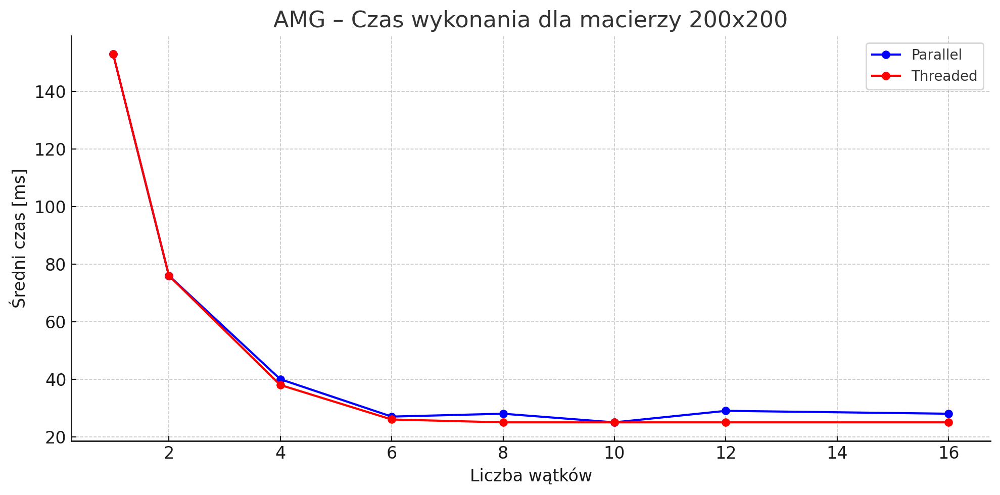
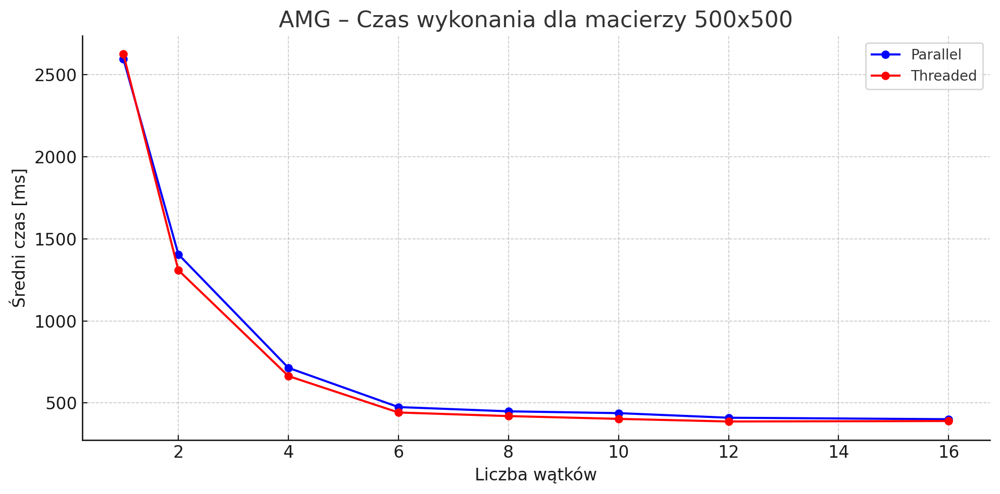
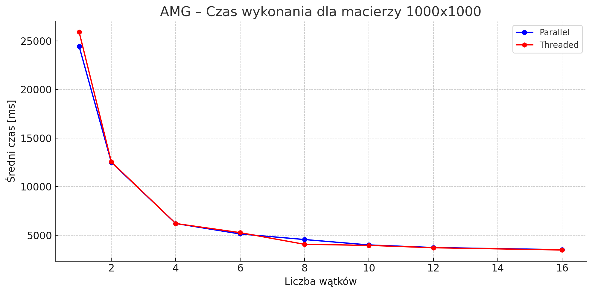
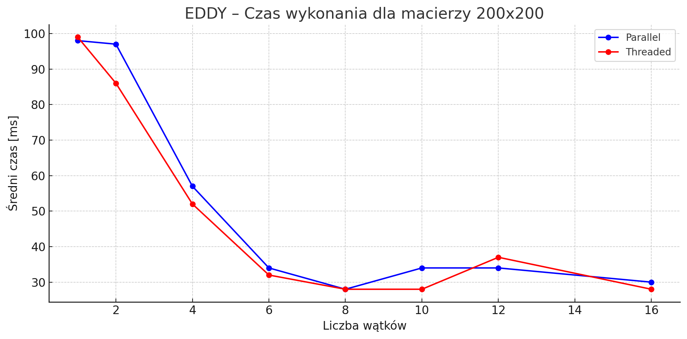
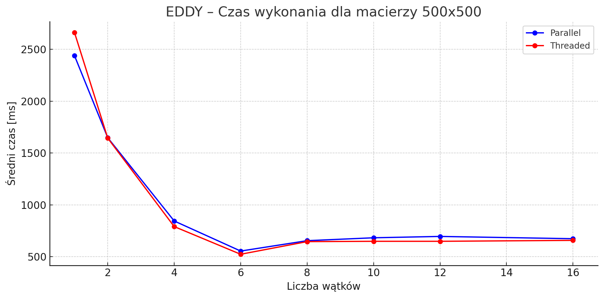
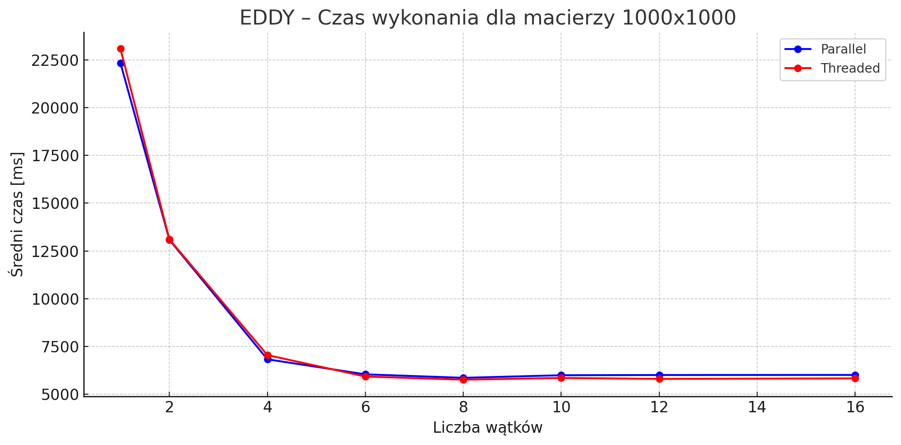

# Laboratorium 3 - Programowanie Wielowątkowe .NET

> Autor: Adrian Goral
> 
> Zadanie wykonane w ramach zajęć na Politechnice Wrocławskiej.

## Zadania do wykonania
1. Wysokopoziomowe mnożenie macierzy z wykorzystaniem `Parallel`.
2. Niskopoziomowe mnożenie macierzy z wykorzystaniem `Thread`.
3. Przetwarzanie obrazu z GUI (Windows Forms)

## Testy z zadania 1 i 2

Wykonanych zostało 10 testów dla każdej permutacji podanych parametrów:
```cs
int[] sizes = { 200, 500, 1000 };
int[] threadCounts = { 1, 2, 4, 6, 8, 10, 12, 16 };
```

Testy odbyły się na dwóch komputerach:
- Komputer 1 (`EDDY`):
  - Procesor: Intel Core i5-1035G1 @ 1.00GHz ; 4 rdzenie, 8 wątków
  - RAM: 8GB
  - System: Windows 11 Home 64-bit
- Komputer 2 (`AMG`):
  - Procesor: Intel Core i5-10400 @ 2.90GHz ; 6 rdzenie, 12 wątków
  - RAM: 32GB
  - System: Windows 11 Pro 64-bit

### Wyniki testów

> Zarówno dla `Parallel` jak i `Thread` wyniki są podane w milisekundach.

#### AMG – Macierz 200x200

|   Threads |   Parallel |   Threaded |
|----------:|-----------:|-----------:|
|         1 |        153 |        153 |
|         2 |         76 |         76 |
|         4 |         40 |         38 |
|         6 |         27 |         26 |
|         8 |         28 |         25 |
|        10 |         25 |         25 |
|        12 |         29 |         25 |
|        16 |         28 |         25 |



#### AMG – Macierz 500x500

|   Threads |   Parallel |   Threaded |
|----------:|-----------:|-----------:|
|         1 |       2598 |       2627 |
|         2 |       1406 |       1309 |
|         4 |        714 |        664 |
|         6 |        475 |        442 |
|         8 |        449 |        420 |
|        10 |        438 |        403 |
|        12 |        410 |        387 |
|        16 |        401 |        390 |



#### AMG – Macierz 1000x1000

|   Threads |   Parallel |   Threaded |
|----------:|-----------:|-----------:|
|         1 |      24431 |      25904 |
|         2 |      12507 |      12550 |
|         4 |       6215 |       6215 |
|         6 |       5141 |       5276 |
|         8 |       4567 |       4076 |
|        10 |       4012 |       3966 |
|        12 |       3744 |       3723 |
|        16 |       3525 |       3491 |



#### EDDY – Macierz 200x200

|   Threads |   Parallel |   Threaded |
|----------:|-----------:|-----------:|
|         1 |         98 |         99 |
|         2 |         97 |         86 |
|         4 |         57 |         52 |
|         6 |         34 |         32 |
|         8 |         28 |         28 |
|        10 |         34 |         28 |
|        12 |         34 |         37 |
|        16 |         30 |         28 |



#### EDDY – Macierz 500x500

|   Threads |   Parallel |   Threaded |
|----------:|-----------:|-----------:|
|         1 |       2438 |       2661 |
|         2 |       1647 |       1643 |
|         4 |        844 |        790 |
|         6 |        554 |        523 |
|         8 |        654 |        645 |
|        10 |        682 |        648 |
|        12 |        695 |        648 |
|        16 |        673 |        657 |




#### EDDY – Macierz 1000x1000

|   Threads |   Parallel |   Threaded |
|----------:|-----------:|-----------:|
|         1 |      22342 |      23090 |
|         2 |      13081 |      13102 |
|         4 |       6828 |       7048 |
|         6 |       6040 |       5924 |
|         8 |       5858 |       5760 |
|        10 |       5993 |       5851 |
|        12 |       6005 |       5801 |
|        16 |       6009 |       5828 |



## Wnioski z badań

- Skalowanie z liczbą wątków:

  - W obu przypadkach dla małych macierzy (np. 200x200) wzrost liczby wątków szybko przynosi korzyści, ale od pewnego momentu przyrosty są minimalne, a nawet czasem rośnie czas (overhead).

  - Dla większych macierzy (1000x1000) skalowanie jest bardziej liniowe i efektywne, co pokazuje zalety wielowątkowości w przypadku bardziej kosztownych obliczeń.

- Parallel vs Threaded:

  - Dla małych rozmiarów macierzy i mniejszej liczby wątków różnice są znikome, a Threaded czasami bywa nawet szybsze (niższy overhead?).

  - Dla większych rozmiarów macierzy, Parallel często wygrywa na AMG, ale nieznacznie przegrywa z Threaded na EDDY – co może świadczyć o różnicach w architekturze CPU/systemie.

- Zjawisko nasycenia:

  - Widoczne np. przy Threads = 8+ – czas przestaje znacząco spadać, a czasem nawet się pogarsza (szczególnie dla macierzy 200x200).

  - Może to wynikać z ograniczeń CPU (np. liczby fizycznych rdzeni) lub narzutu związanego z zarządzaniem zbyt wieloma wątkami.
